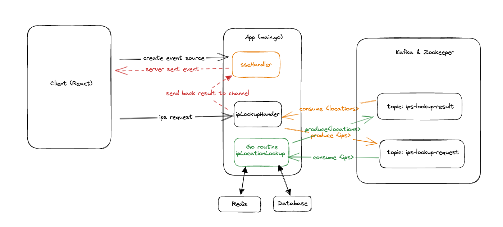

# IP LOCATION LOOKUP 
#### (React + Golang + Kafka + Redis + DB)

## Table of Content
* [Overview](#overview)
* [Demo](#demo)
* [Technical Aspect](#technical-aspect)
    * [Design Diagram](#design-diagram)
    * [System Design](#system-diagram)
    * [Tech Skills](#tech-skills)
* [Tests](#tests)
* [Installation](#installation)


## Overview
Create a web form that allow the user to enter one or more IP addresses. On submission, it
should look up these IP addresses in the GeoLite2 City database and display the following for
each IP address:

- Country Code
- Postal Code
- City Name
- Time Zone
- Accuracy Radius

## Demo


## Technical Aspect


### Design Diagram



### System Design

The system design follows a decoupled architecture, where the frontend client establishes a stream with the backend upon rendering. The backend creates a channel specific to the client for communication.

When the client submits IP addresses to the backend, the ipLocationHandler produces a message to the Kafka topic "ips-lookup-request", as well as consuming messages from the "ips-lookup-result" topic. If a response is received from the topic, it is sent back to the client via the dedicated channel.

There is a separate demon service, ipLocationLookup, that is responsible for consuming messages from the "ips-lookup-request" topic and producing results to the "ips-lookup-result" topic. This service communicates with the storage layer to retrieve the necessary information for IP location lookup.

Overall, the system utilizes Kafka to handle high-concurrency and real-time updates via server-sent events, while also providing a decoupled architecture to ensure scalability and maintainability.

### Tech Skills

#### Frontend
- Typescript Programming
- React, React-Bootstrap
- Jest unit test

#### Backend
- Golang programming
- Redis
- Kafka & Zookeeper
- SOLID principle
- Unit test

## Tests

### Frontend


### Backend


## Installation

### Development

```zsh
cd ./backend/
docker build -t ip-lookup-app .

cd ./frontend/
docker build -t ip-lookup-web .

cd ./
docker-compose up --build
```

Running Containers 


After everything started, please go to:

http://localhost
